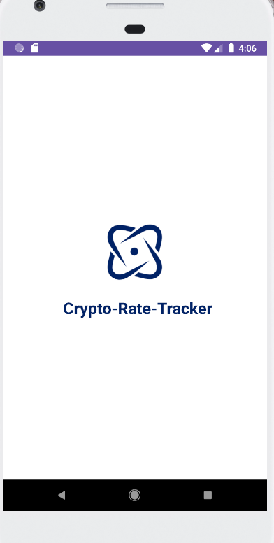
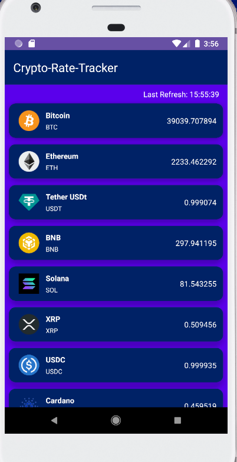
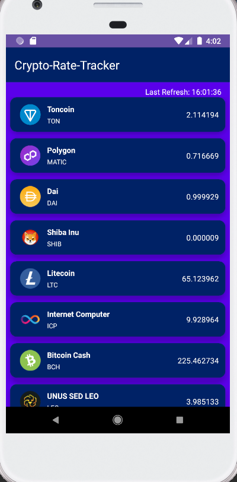
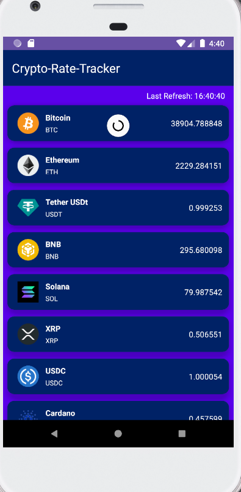
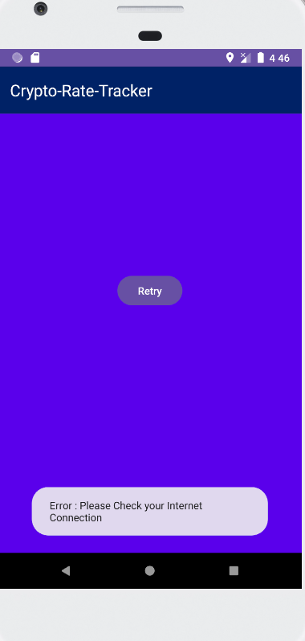

# Crypto-Rate-Tracker

Crypto-Rate-Tracker is a feature-rich Android app that provides real-time cryptocurrency exchange rates, ensuring you stay up-to-date with the ever-changing world of digital currencies.It offers a user-friendly interface with a range of functionalities to enhance your cryptocurrency tracking experience.

## Getting Started

1. Sign up with <a href= "https://coinmarketcap.com/" > CoinMarketCap </a> and get your API key.
2. API Key Integration:
 Once you have your CoinLayer API key, navigate to the app MainActivity and enter the key to enable real-time data fetching.
3. Explore Cryptocurrencies:
* Access a comprehensive list of cryptocurrencies, each item displaying:
  - Full name
  - Icon
  - Exchange rate (rounded to 6 decimal places)
* Additional information (icons and full names) fetched from CoinMarket's list API.

## Features

### 1. Currency Feed

Browse through a well-organized feed of cryptocurrencies. Each currency item includes detailed information about its cryptocurrency.

### 2. Refresh Functionality

 

* Swipe-to-Refresh:
   Manually update exchange rates by swiping down on the screen.
* Auto-Refresh:
   Automatic data refresh every 3 minutes to keep information current.
* Last Refresh Timestamp:
   Dedicated UI section displaying the timestamp of the last refresh.

### 3. Retry Feature

In case of connectivity issues or API errors, use the retry button to reload the currency feed.

 

## Usage

- Explore the list of cryptocurrencies with detailed information.
- Swipe down to manually refresh exchange rates.
- Benefit from automatic updates every 3 minutes.
- Use the retry button to reload the feed in case of issues.

 ## Acknowledgments

Special thanks to <a href= "https://coinmarketcap.com/" > CoinMarketCap </a> for providing the API used in this app.

Contributions and feedback are welcome.

Happy tracking! 🚀

